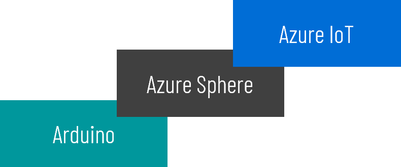
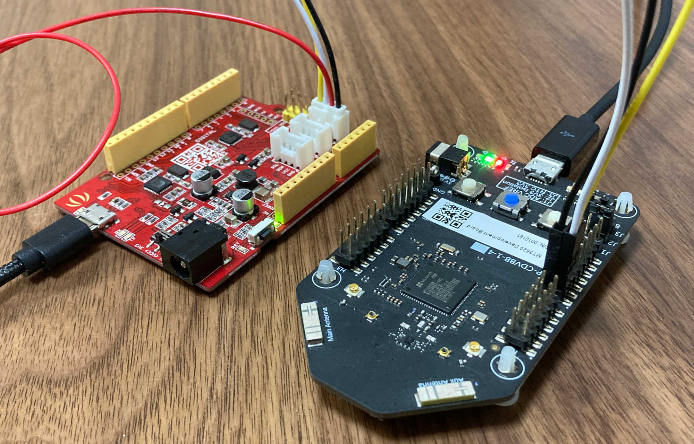
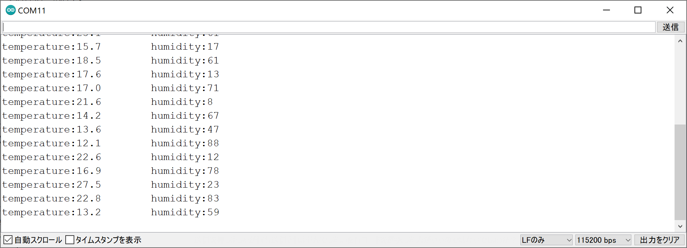
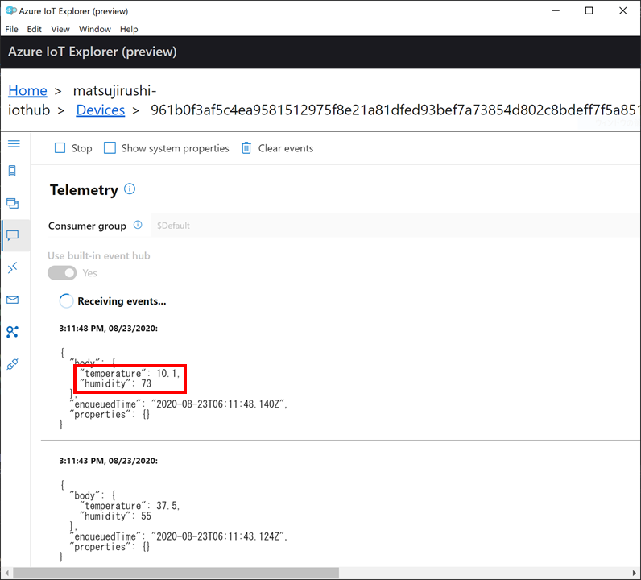
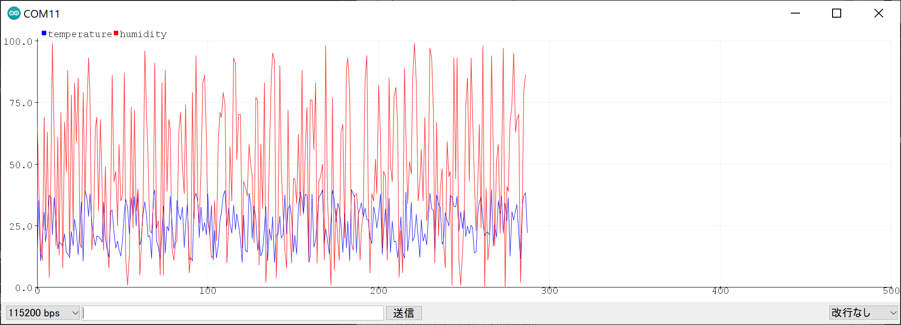

# UART to AzureIoT

<br>
<div align="center">

</div>
<br>

UART to AzureIoTは、Arduinoを安全にインターネットに接続し、Azure IoTと連携する、Azure Sphereのプログラムです。  
Azure Sphereを仲介することで、悪意のあるインターネットからの攻撃、脅威から保護できます。  
ArduinoとAzure Sphereの通信はUARTでテキストベースなので、Arduino以外の独自デバイスを使うことも可能です。

```
+---------+                  +------------+             +-------------------+
| Arduino | <- UART(3.3V) -> | MT3620 RDB | <- Wi-Fi -> | Azure IoT Central |
+---------+                  +------------+             | Azure IoT Hub     |
                                                        +-------------------+
```

## 必要なもの

* [Seeeduino V4.2](https://wiki.seeedstudio.com/Seeeduino_v4.2/)
* [Azure Sphere MT3620開発ボード](https://wiki.seeedstudio.com/Azure_Sphere_MT3620_Development_Kit/)（MT3620 RDB）
* [ジャンパー・メス付きGroveケーブル](https://www.seeedstudio.com/Grove-4-pin-Female-Jumper-to-Grove-4-pin-Conversion-Cable-5-PCs-per-PAck.html)

## 動かし方

TBD

  
  
  
  

## ロードマップ

**Phase 1**　<--- イマココ
* テレメトリ機能のみ。（シリアルプロッタと同一プロトコル）
* 接続先はAzure IoT Hubのみ。

**Phase 2**
* Azure IoT Hub DPSに対応。
* Azure IoT Centralに対応。

**Phase 3**
* プロパティ機能とコマンド機能を追加。（独自プロトコル）

**Phase 4**
* IoT Plug and Playに対応？

## Licence

[MIT](LICENSE.txt)
